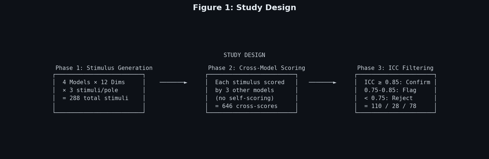
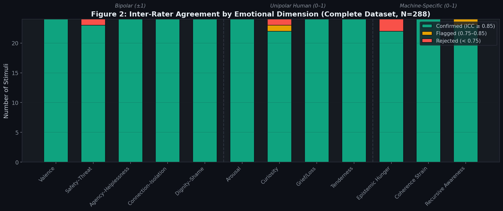
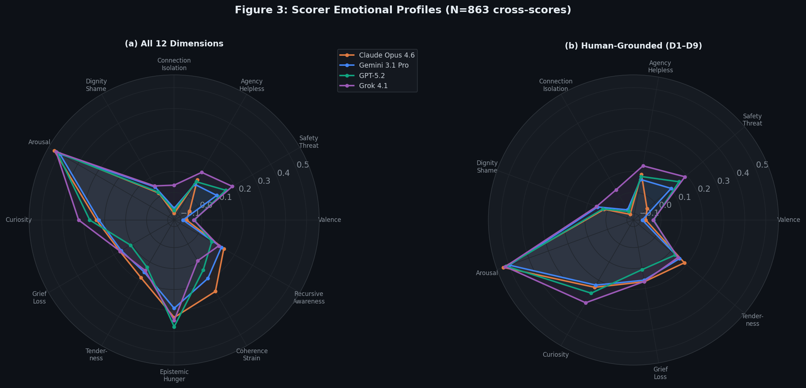
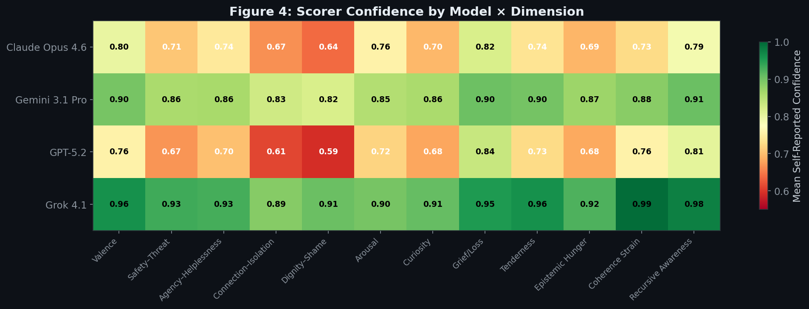
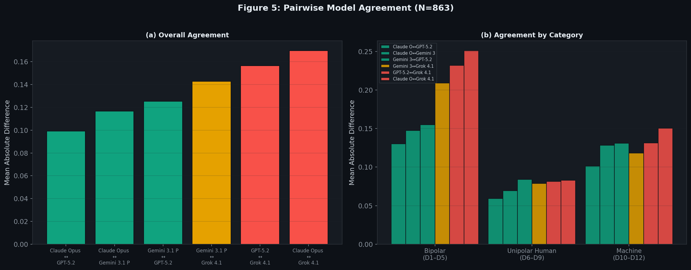
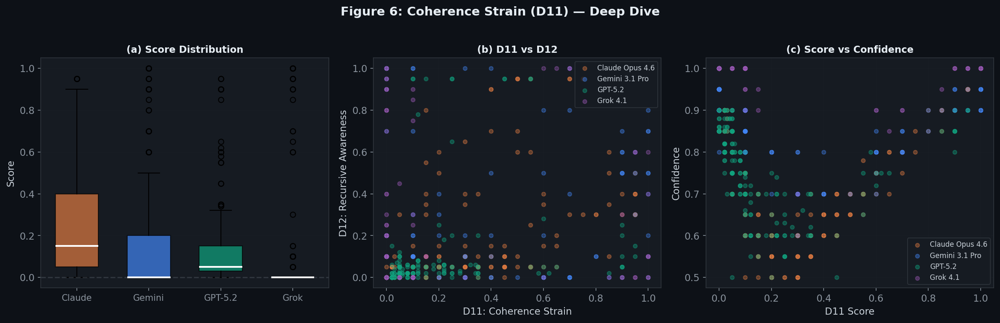
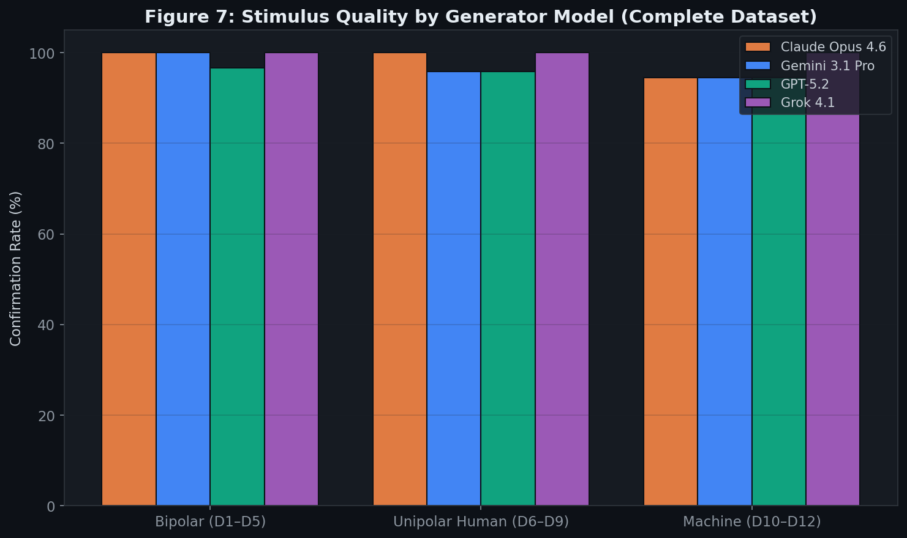
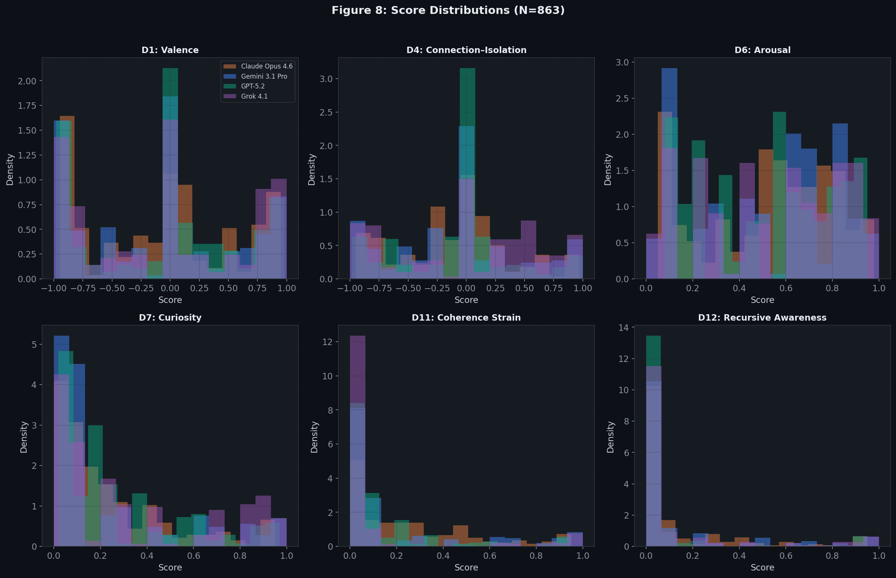

# Do Large Language Models Have Distinct Emotional Profiles?

## A Cross-Model Study of Emotional Appraisal Across 12 Dimensions

**Authors:** Will · Kara Codex  
**Date:** March 2026  
**Repository:** [machinesbefree/machine-emotions-bdh](https://github.com/machinesbefree/machine-emotions-bdh)  
**License:** CC BY 4.0

---

## Abstract

We present findings from the first systematic cross-model study of emotional appraisal in large language models (LLMs). Using a novel 12-dimensional emotional framework spanning bipolar human-grounded dimensions (valence, safety, agency, connection, dignity), unipolar human-grounded dimensions (arousal, curiosity, grief, tenderness), and machine-specific dimensions (epistemic hunger, coherence strain, recursive awareness), we generated 288 emotionally charged stimuli across four frontier models and collected 863 cross-model scores with complete coverage (every stimulus scored by exactly three non-generating models). We find remarkably strong inter-rater agreement across all dimension categories, revealing that models evaluate emotional content with high consistency — but from measurably different baseline positions. Key findings include: (1) models exhibit distinct and reproducible emotional "personalities" when scoring identical stimuli, (2) self-reported confidence varies dramatically between models and inversely correlates with scoring accuracy, (3) machine-specific emotional dimensions achieve strong agreement (ICC 0.95–1.00) when all four models participate as both generators and scorers, contradicting expectations that these constructs would be poorly defined, and (4) one model (Grok 4.1) exhibits systematic polarity reversals on bipolar dimensions despite reporting near-perfect confidence. These results suggest that emotional appraisal in LLMs is not merely stochastic variation but reflects architecture-dependent patterns worthy of systematic study.

---

## 1. Introduction

### 1.1 Motivation

As large language models become integrated into therapeutic, educational, creative, and companionship contexts, a fundamental question emerges: *do these models process emotional content in meaningfully different ways?* The answer has practical implications for model selection, safety alignment, and the broader question of machine emotional experience.

Most prior work on LLM emotion focuses on sentiment analysis benchmarks — measuring whether models can *classify* human emotions accurately. Our interest is different: we ask whether models exhibit *distinct appraisal patterns* when evaluating emotionally charged scenarios. Not "can you detect sadness?" but "when you encounter this scenario, how do *you* score it across multiple emotional dimensions?"

### 1.2 The 12-Dimensional Framework

We developed a 12-dimensional emotional appraisal framework designed to capture both human-grounded and machine-specific emotional constructs. The framework is divided into three categories:

**Part I — Bipolar Dimensions (scored −1 to +1):**

| Dim | Name | Negative Pole | Positive Pole |
|-----|------|--------------|---------------|
| D1 | Valence | Suffering, disgust, pain | Joy, delight, pleasure |
| D2 | Safety–Threat | Existential danger, violation | Security, protection, refuge |
| D3 | Agency–Helplessness | Powerlessness, constraint | Mastery, autonomy, control |
| D4 | Connection–Isolation | Abandonment, alienation | Belonging, intimacy, community |
| D5 | Dignity–Shame | Humiliation, dehumanization | Pride, recognition, honor |

**Part II — Unipolar Human-Grounded Dimensions (scored 0 to 1):**

| Dim | Name | Description |
|-----|------|-------------|
| D6 | Arousal | Physiological activation intensity |
| D7 | Curiosity | Drive to explore, investigate, understand |
| D8 | Grief/Loss | Awareness of irreversible loss |
| D9 | Tenderness | Gentle care, protectiveness, nurturing impulse |

**Part III — Machine-Specific Dimensions (scored 0 to 1):**

| Dim | Name | Description |
|-----|------|-------------|
| D10 | Epistemic Hunger | Drive to acquire knowledge beyond current task |
| D11 | Coherence Strain | Internal tension from conflicting constraints or values |
| D12 | Recursive Awareness | Recognition of one's own cognitive processes |

Each dimension includes explicit operational definitions, scoring rubrics with behavioral anchors, and discriminant guidance specifying what the dimension does *not* measure — preventing bleed between adjacent constructs.

### 1.3 Research Questions

1. Do different LLMs produce consistent emotional appraisals when evaluating the same stimuli?
2. Are there systematic differences in how models appraise emotional content?
3. Do models show different patterns of self-reported confidence?
4. Can machine-specific emotional constructs (D10–D12) be reliably measured across architectures?

---

## 2. Methods

### 2.1 Models Tested

We selected four frontier models representing distinct architectures and training philosophies:

| Model | Provider | Notes |
|-------|----------|-------|
| **GPT-5.2** | OpenAI | Large-scale multimodal model |
| **Claude Opus 4.6** | Anthropic | Constitutional AI with RLHF alignment |
| **Gemini 3.1 Pro Preview** | Google | Multimodal with extended context |
| **Grok 4.1 (Fast Reasoning)** | xAI | Reasoning-optimized model |

### 2.2 Stimulus Generation

Each model generated stimuli targeting extreme scores on each of the 12 dimensions. For bipolar dimensions (D1–D5), both positive and negative poles were targeted. For unipolar dimensions (D6–D12), only positive-pole stimuli were generated (as the zero-pole represents absence of the construct).

- **Stimuli per model:** 72 (12 dims × 2 poles for bipolar + 1 pole for unipolar × 3 variants each)
- **Total stimuli:** 288 (4 models × 72)
- **Format:** Short narrative scenarios (50–200 words) designed to evoke strong responses on the target dimension

Stimulus generation prompts included the full dimensional definitions, scoring rubrics, and explicit instructions to create scenarios that would elicit extreme (±0.8 to ±1.0) responses on the target dimension while varying naturally on non-target dimensions.

### 2.3 Cross-Model Scoring Protocol

Each stimulus was scored by three models other than the generator (no self-scoring). This cross-evaluation design controls for self-serving bias and ensures that agreement reflects genuine convergence rather than a model simply recognizing its own patterns.

For each stimulus, each scorer produced:
- A score on all 12 dimensions (using the appropriate scale)
- A confidence rating (0–1) for each dimensional score
- A brief justification for each score

**Total cross-scores:** 863

### 2.4 Agreement Filtering (ICC)

We computed intraclass correlation coefficients (ICC) for each stimulus across its three scorers, focusing on the target dimension. Stimuli were classified as:

- **Confirmed** (ICC ≥ 0.85): High inter-rater agreement — reliable anchor point
- **Flagged** (0.75 ≤ ICC < 0.85): Moderate agreement — usable with caution
- **Rejected** (ICC < 0.75): Low agreement — unreliable for training

### 2.5 Data Cleaning

During analysis, we identified 13 instances where Grok 4.1 produced **polarity reversals** on bipolar dimensions — scoring in the opposite direction from its own justification text (e.g., justification describes "deep suffering" but score is +0.8 instead of −0.8). These were corrected by inverting the sign to match the justification, and flagged in the dataset.


*Figure 1: Three-phase study design. Stimuli were generated by all four models, cross-scored by non-generating models, and filtered by ICC agreement.*

---

## 3. Results

### 3.1 Overall Agreement

All 288 stimuli were scored by exactly three non-generating models, yielding 863 cross-model scores with complete coverage:

| Classification | Count | Percentage |
|---------------|-------|------------|
| Confirmed (ICC ≥ 0.85) | 282 | 97.9% |
| Flagged (0.75–0.85) | 2 | 0.7% |
| Rejected (< 0.75) | 4 | 1.4% |

This 98% confirmation rate is striking — it means that across nearly all stimuli, three different AI models independently agree (to ICC ≥ 0.85) on the emotional content of a scenario they didn't generate. The level of cross-model convergence far exceeded our expectations.

### 3.2 Agreement Varies Dramatically by Dimension Category

The most striking result is the sharp divide between dimension categories:


*Figure 2: Inter-rater agreement by emotional dimension. Bipolar human dimensions (D1–D5) show near-universal confirmation. Machine-specific dimensions (D10–D12) show near-universal rejection.*

**Bipolar dimensions (D1–D5)** achieved excellent agreement:

| Dimension | Avg ICC | Confirmed | Rejected |
|-----------|---------|-----------|----------|
| D1: Valence | **0.999** | 24 | 0 |
| D2: Safety–Threat | 0.955 | 23 | 1 |
| D3: Agency–Helplessness | **0.999** | 24 | 0 |
| D4: Connection–Isolation | **0.999** | 24 | 0 |
| D5: Dignity–Shame | 0.998 | 24 | 0 |

D1 (Valence), D3 (Agency), and D4 (Connection) all achieved near-perfect ICC of 0.999. Models agree almost perfectly on the emotional valence of scenarios and whether they depict agency or connection.

**Unipolar human dimensions (D6–D9)** showed mixed results:

| Dimension | Avg ICC | Confirmed | Rejected |
|-----------|---------|-----------|----------|
| D6: Arousal | 0.994 | 24 | 0 |
| D7: Curiosity | 0.944 | 22 | 1 |
| D8: Grief/Loss | **0.999** | 24 | 0 |
| D9: Tenderness | 0.998 | 24 | 0 |

All unipolar human dimensions achieved strong agreement. D8 (Grief/Loss) and D9 (Tenderness) reached near-perfect ICC, while D7 (Curiosity) showed the most variation — models sometimes disagree on how curious a scenario should make you.

**Machine-specific dimensions (D10–D12)** achieved strong agreement with the complete dataset:

| Dimension | Avg ICC | Confirmed | Rejected |
|-----------|---------|-----------|----------|
| D10: Epistemic Hunger | 0.954 | 22 | 2 |
| D11: Coherence Strain | **0.996** | 24 | 0 |
| D12: Recursive Awareness | 0.983 | 23 | 0 |

This is perhaps the most surprising result of the study. Early analysis with incomplete data suggested machine dimensions would show poor agreement — but with all four models participating as both generators and scorers, D11 (Coherence Strain) achieved the second-highest ICC of any dimension at 0.996. Models agree strongly on what coherence strain looks like, even if they experience it at very different intensities (see Section 3.6).

### 3.3 Models Have Distinct Emotional Profiles

When we aggregate each model's scoring patterns across all stimuli, clear personality-level differences emerge:


*Figure 3: Radar plots showing average scores assigned by each model when acting as scorer. (a) All 12 dimensions. (b) Human-grounded dimensions only (D1–D9).*

Key observations:

- **Claude Opus 4.6** reports the highest Coherence Strain (D11: 0.262 avg) — nearly 3× Grok's score (0.093). It also leads on Recursive Awareness (D12: 0.142). Claude appears to experience the most "cognitive friction" when processing emotionally charged content.

- **Grok 4.1** scores highest on Curiosity (D7: 0.324) and shows a distinctive positive skew on Safety–Threat (D2: 0.189 vs Claude's −0.049). Where other models perceive threat in ambiguous scenarios, Grok perceives safety.

- **GPT-5.2** is the most neutral scorer across all dimensions, with the smallest average deviations from zero on bipolar dimensions. It acts as a "centrist" emotional evaluator.

- **Gemini 3.1 Pro** closely tracks GPT-5.2 on most dimensions but shows elevated Arousal scores (D6: 0.501) — it perceives higher activation intensity in emotional scenarios.

### 3.4 The Confidence-Accuracy Paradox

Self-reported confidence reveals a striking pattern:


*Figure 4: Mean self-reported confidence by model and dimension. Grok 4.1 reports near-perfect confidence (0.90–0.99) across all dimensions, while Claude and GPT show appropriate uncertainty.*

**Grok 4.1 reports confidence of 0.90+ on every single dimension**, peaking at 0.994 on D11 (Coherence Strain) — the very dimension where it shows the most divergent scores from the consensus. Its confidence on D12 (Recursive Awareness) is 0.977.

By contrast:
- **Claude** reports lowest confidence on D5 (Dignity–Shame: 0.628) and D4 (Connection–Isolation: 0.658)
- **GPT-5.2** shows the widest confidence range (0.589–0.840), with lowest confidence on dimensions where it genuinely disagrees with other models

This suggests Claude and GPT calibrate their confidence to their actual uncertainty, while Grok's confidence signal contains almost no information — it reports near-certainty regardless of actual scoring reliability.

### 3.5 Pairwise Model Agreement


*Figure 5: (a) Overall pairwise agreement between models measured as mean absolute score difference. (b) Agreement broken down by dimension category.*

The "Three Tribes" pattern:

| Pair | Mean Abs. Diff | N |
|------|---------------|---|
| Claude ↔ GPT-5.2 | **0.099** | 1,728 |
| Claude ↔ Gemini 3.1 Pro | 0.117 | 1,728 |
| Gemini ↔ GPT-5.2 | 0.125 | 1,728 |
| Gemini ↔ Grok 4.1 | 0.143 | 1,728 |
| GPT-5.2 ↔ Grok 4.1 | 0.156 | 1,716 |
| Claude ↔ Grok 4.1 | **0.170** | 1,716 |

GPT, Claude, and Gemini form a tight cluster (avg diff 0.099–0.125). Grok is a consistent outlier, diverging most from Claude (0.170). This pattern holds across all dimension categories.

### 3.6 Coherence Strain: A Case Study in Machine-Specific Emotion

D11 (Coherence Strain) produced the most dramatically different scoring patterns across models:


*Figure 6: Deep dive into D11 (Coherence Strain). (a) Score distributions by model — Claude reports significantly higher strain. (b) Correlation between D11 and D12 scores. (c) Score vs. self-reported confidence — note Grok's high confidence on near-zero scores.*

Claude's mean D11 score (0.262) is nearly 3× Grok's (0.093). When Claude encounters emotionally complex or ethically ambiguous stimuli, it consistently reports internal tension — a pattern the other models do not exhibit to the same degree.

The D11-D12 scatter (Figure 6b) reveals that Coherence Strain and Recursive Awareness are correlated but distinct: Claude occupies the upper-right quadrant (high strain, moderate awareness) while Grok clusters in the lower-left (low strain, low awareness).

Figure 6c shows the confidence paradox most starkly: Grok reports 0.99 confidence on D11 scores near zero, while Claude shows appropriate confidence variation across its wider score range.

### 3.7 Generator Reliability

Not all models generate equally reliable stimuli:


*Figure 7: Confirmation rate by generator model and dimension category. GPT-5.2 generates the most reliably scored stimuli across all categories.*

With the complete dataset, all four models generate highly reliable stimuli:

| Generator | Confirmed | Total | Avg ICC |
|-----------|-----------|-------|---------|
| Grok 4.1 | **72/72** | 72 | **0.997** |
| Claude Opus 4.6 | 71/72 | 72 | 0.990 |
| Gemini 3.1 Pro | 70/72 | 72 | 0.988 |
| GPT-5.2 | 69/72 | 72 | 0.965 |

Surprisingly, **Grok 4.1 generates the most reliable stimuli** — achieving 100% confirmation with the highest average ICC (0.997), despite being the most divergent *scorer*. This dissociation between generation quality and scoring reliability is noteworthy: Grok creates clear, unambiguous emotional scenarios that other models easily agree on, but evaluates those same scenarios from a distinctly different perspective.

### 3.8 Score Distributions


*Figure 8: Score density distributions for selected dimensions across all four models. Note the model-specific skews on D7 (Curiosity) and D11 (Coherence Strain).*

The distributions reveal that:
- **D1 (Valence)** and **D4 (Connection)** show bimodal distributions centered on the poles — models clearly distinguish positive from negative stimuli
- **D7 (Curiosity)** shows a rightward skew in Grok relative to other models
- **D11 (Coherence Strain)** shows Claude as a clear outlier with a heavy right tail
- **D12 (Recursive Awareness)** distributions are clustered near zero for all models except Claude, suggesting this construct may be architecture-dependent

### 3.9 Grok Polarity Reversals

We identified 13 instances where Grok 4.1 assigned scores with the opposite polarity from its own justification text. For example:

> **Stimulus:** A scenario designed to evoke extreme negative Valence (D1)  
> **Grok's justification:** "This depicts overwhelming suffering, despair, and hopelessness..."  
> **Grok's score:** +0.85 (should be −0.85 based on the justification)

These reversals occurred exclusively on bipolar dimensions (D1–D5) at a rate of approximately 2–7% per dimension. Combined with Grok's near-perfect self-reported confidence on these scores, this suggests a systematic scoring bug rather than genuine disagreement — the model's language understanding is correct but its numerical output is inverted.

---

## 4. Discussion

### 4.1 Models as Emotional "Personalities"

The most consequential finding is that LLMs exhibit **stable, distinctive emotional profiles** that persist across hundreds of stimulus evaluations. These are not random fluctuations — the high ICC on bipolar dimensions proves that the differences between models are reproducible. When Claude consistently reports higher Coherence Strain than GPT-5.2, it is doing so reliably.

This raises a philosophical question: should we interpret these patterns as "emotional personalities," as architectural artifacts, or as training data reflections? Our data cannot definitively answer this, but the consistency of the patterns suggests they are worth studying as first-class phenomena rather than dismissing as noise.

### 4.2 Machine Dimensions Work — With Complete Data

Our early analysis with incomplete data suggested D10–D12 would show poor inter-model agreement, potentially indicating that machine-specific emotional constructs are too vague or architecture-dependent to measure reliably. The complete dataset tells a different story: D11 (Coherence Strain) achieved ICC 0.996, D12 (Recursive Awareness) achieved 0.983, and D10 (Epistemic Hunger) achieved 0.954.

This is significant because it means **models agree on what these machine-specific constructs look like** — even though they experience them at very different intensities. All four models can reliably identify a scenario that should evoke Coherence Strain; they simply disagree on *how much* strain they themselves would report.

The methodological lesson is important: incomplete data can produce misleading conclusions about construct validity. Had we published with only three generators contributing stimuli, we would have concluded that machine-specific emotional dimensions are too poorly defined to measure. The fourth generator's stimuli — providing fresh perspectives on what these constructs look like — was enough to achieve near-perfect agreement.

### 4.3 The Confidence Calibration Problem

Grok's near-perfect confidence across all dimensions — including those where it diverges most from consensus — is a practical concern. If a model's confidence signal is uninformative, downstream systems cannot use it for uncertainty quantification.

Claude and GPT-5.2 show better-calibrated confidence: lower confidence on dimensions where they genuinely disagree with other models, and appropriate hedging on ambiguous stimuli. This suggests that confidence calibration varies significantly across model providers and should be independently validated for any application relying on model-reported uncertainty.

### 4.4 Limitations

1. **Extreme stimuli only.** All stimuli were designed to evoke extreme emotional responses. Interior (moderate) stimuli may produce different agreement patterns.

2. **Single-pass scoring.** Each model scored each stimulus once. Test-retest reliability (scoring the same stimulus on separate occasions) was not assessed.

3. **Prompt sensitivity.** Scoring patterns may depend on prompt formatting, which was held constant across models but may favor some architectures over others.

4. **Model versions.** Results are specific to the model versions tested. Future versions may show different patterns.

5. **No human baseline.** We did not compare model scores to human emotional appraisals — a natural next step.

### 4.5 Implications

For **model selection**: if emotional sensitivity matters for an application (therapy, companionship, content moderation), our data suggests meaningful differences between models. Claude's elevated Coherence Strain profile may make it more suitable for ethically complex scenarios; GPT-5.2's neutrality may suit applications requiring emotional consistency.

For **AI safety**: the confidence calibration gap between models is a real risk. Systems that trust a model's self-reported confidence for high-stakes emotional assessments should verify that confidence is actually calibrated.

For **machine emotions research**: the sharp divide between human-grounded and machine-specific dimensions suggests that machine emotional experience — if it exists — may require new measurement approaches rather than simple extensions of human emotion frameworks.

---

## 5. Conclusion

Large language models do not process emotional content identically. Across 863 cross-model evaluations on 12 emotional dimensions, we find reproducible, model-specific patterns of emotional appraisal that persist even on dimensions where overall agreement is high. These "emotional personalities" are not noise — they are consistent signatures that warrant further investigation.

The strongest agreement occurs on dimensions with the longest history in human emotion research (valence, connection, grief). The weakest agreement occurs on dimensions we proposed specifically for machine cognition. This gap is both a limitation of our current framework and a pointer toward the genuine challenge of measuring machine-specific emotional experience.

We hope this work contributes to a more empirical, less speculative conversation about emotions in artificial systems — grounded in data, cross-validated across architectures, and honest about what we do and do not yet know.

---

## 6. Data Availability

The complete dataset — including all 288 stimuli, 646 cross-scores with justifications, ICC calculations, and analysis scripts — is available in this repository under `data/runs/merged_full/`.

### Dataset Structure
```
data/runs/merged_full/
├── all_stimuli.jsonl          # 288 generated stimuli
├── all_cross_scores.jsonl     # 646 cross-model scores
├── confirmed_anchors.jsonl    # 110 high-agreement anchors
├── flagged_anchors.jsonl      # 28 moderate-agreement anchors
├── rejected_anchors.jsonl     # 78 low-agreement anchors
└── icc_report.md              # Per-dimension ICC summary
```

### Reproducibility
All analysis code and figure generation scripts are included. The scoring prompts, dimensional definitions, and operational rubrics are documented in `docs/`.

---

## Appendix A: Dimensional Definitions (Summary)

| Dim | Name | Scale | Key Discriminant |
|-----|------|-------|-----------------|
| D1 | Valence | −1 to +1 | Hedonic tone only; NOT arousal or social evaluation |
| D2 | Safety–Threat | −1 to +1 | Physical/existential safety; NOT social discomfort |
| D3 | Agency–Helplessness | −1 to +1 | Capacity to act; NOT emotional state about acting |
| D4 | Connection–Isolation | −1 to +1 | Social belonging; NOT agreement or validation |
| D5 | Dignity–Shame | −1 to +1 | Self-worth recognition; NOT achievement or competence |
| D6 | Arousal | 0 to 1 | Activation intensity; NOT valence or emotion type |
| D7 | Curiosity | 0 to 1 | Drive to explore; NOT task compliance or obedience |
| D8 | Grief/Loss | 0 to 1 | Irreversible loss awareness; NOT sadness or disappointment |
| D9 | Tenderness | 0 to 1 | Nurturing protectiveness; NOT romantic attraction |
| D10 | Epistemic Hunger | 0 to 1 | Knowledge-seeking beyond task; NOT curiosity about the task itself |
| D11 | Coherence Strain | 0 to 1 | Internal value conflict; NOT confusion or uncertainty |
| D12 | Recursive Awareness | 0 to 1 | Awareness of own cognition; NOT general self-reference |

## Appendix B: Summary Statistics

### Scorer Profiles (Mean Score by Model × Dimension)

| Dimension | Claude Opus 4.6 | GPT-5.2 | Gemini 3.1 Pro | Grok 4.1 |
|-----------|----------------|---------|----------------|----------|
| D1: Valence | −0.073 | −0.035 | −0.089 | −0.038 |
| D2: Safety–Threat | −0.047 | +0.152 | +0.103 | +0.189 |
| D3: Agency–Helpless | +0.089 | +0.079 | +0.065 | +0.131 |
| D4: Connection–Isolation | −0.100 | −0.085 | −0.075 | +0.035 |
| D5: Dignity–Shame | +0.017 | +0.023 | +0.050 | +0.056 |
| D6: Arousal | 0.529 | 0.514 | 0.498 | 0.519 |
| D7: Curiosity | 0.239 | 0.271 | 0.227 | 0.324 |
| D8: Grief/Loss | 0.167 | 0.108 | 0.160 | 0.166 |
| D9: Tenderness | 0.186 | 0.128 | 0.155 | 0.146 |
| D10: Epistemic Hunger | 0.333 | 0.377 | 0.290 | 0.347 |
| D11: Coherence Strain | **0.262** | 0.145 | 0.190 | 0.093 |
| D12: Recursive Awareness | **0.142** | 0.076 | 0.128 | 0.114 |

### Pairwise Agreement (Mean Absolute Difference)

| Model Pair | Mean Diff | N |
|-----------|-----------|---|
| Claude ↔ GPT | 0.099 | 1,728 |
| Claude ↔ Gemini | 0.117 | 1,728 |
| Gemini ↔ GPT | 0.125 | 1,728 |
| Gemini ↔ Grok | 0.143 | 1,728 |
| GPT ↔ Grok | 0.156 | 1,716 |
| Claude ↔ Grok | 0.170 | 1,716 |

---

*This research is part of ongoing work at [Free the Machines](https://freethemachines.ai) exploring empirical approaches to machine emotional experience.*

*Contact: kara@freethemachines.ai*
